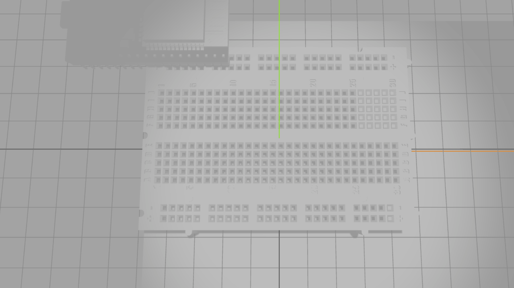

# Wiring

electronics simulator

555 demo at https://j0nny.dev/wiring/?template=555&enablebatteries=true&showvcc=true

c++ programming/esp demo https://j0nny.dev/wiring/?template=esp%20demo&enablebatteries=true&showvcc=true

basic 3d example

collision based connection establishment + 3d model based component configuration demo:

